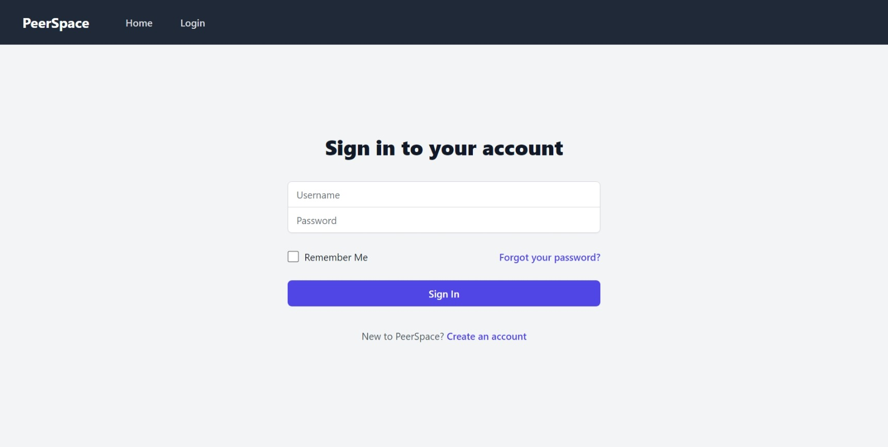
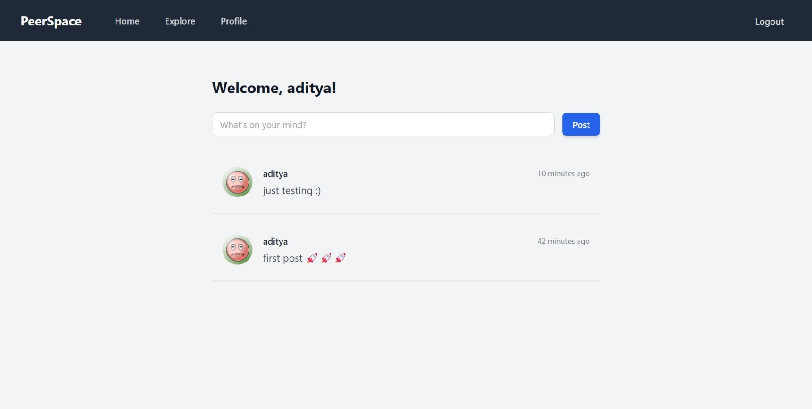
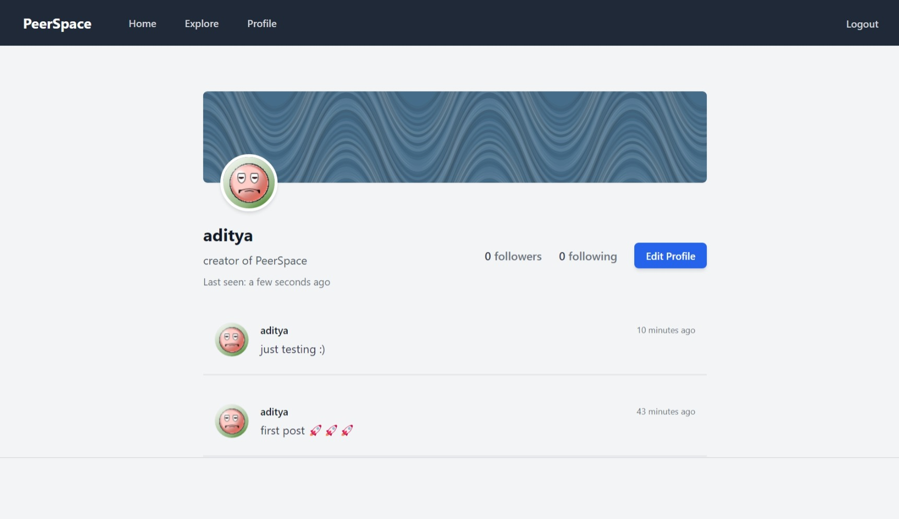

# PeerSpace

**PeerSpace** is a minimal microblogging platform where users can post their thoughts in 140 characters.

## Features
- **User Following**: Users can follow other users.
- **Home Feed**: Users can see posts from people they follow on their home page.
- **Explore Page**: Discover new users and their posts on the explore page.

## Tech Stack
- **Backend**: Flask
- **Database**: PostgreSQL
- **Frontend**: HTML, TailwindCSS, JavaScript

## Screenshots

## Contributing
If you'd like to contribute, please fork the repository and make a pull request. You can also open issues for suggestions or feature requests.